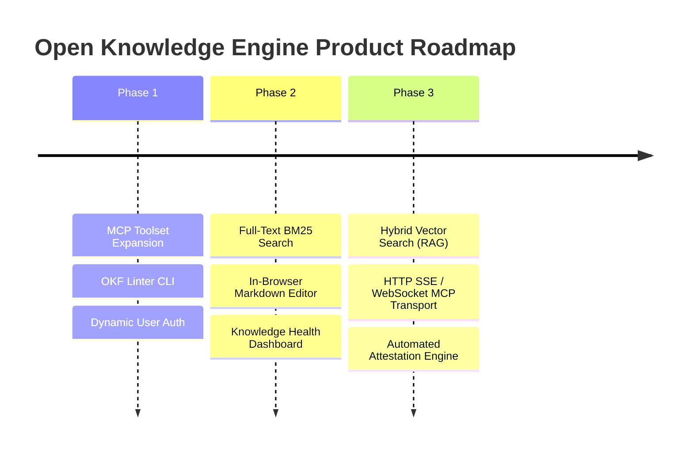

# Open Knowledge Engine - Roadmap & Planned Features

This document outlines the strategic roadmap, planned architectural enhancements, and feature milestones for the **Open Knowledge Engine (OKF v0.2)** platform.

---

## 🗺️ Strategic Vision

The goal of the Open Knowledge Engine is to evolve from a text-native, zero-database knowledge catalog into a enterprise-grade, human-AI collaborative knowledge system. The planned features focus on expanding model context capabilities, enhancing search intelligence, providing interactive web management tools, and automating knowledge verification.

---

## 🎯 Planned Feature Pillars

### 1. 🤖 AI & Agent Integration (MCP Protocol Expansion)
*Targeting deeper LLM agent interoperability and multi-agent coordination.*

- **Extended Model Context Protocol (MCP) Toolset**:
  - `update_concept`: Allow agents to modify existing concept sections, append content, or update YAML frontmatter fields (`status`, `tags`, `stale_after`).
  - `verify_concept`: Enable automated validation agents (CI/CD bots, data quality checkers) to submit machine attestations (`actor: process:<agent-name>`) via JSON-RPC.
  - `traverse_graph` & `get_backlinks`: Expose N-hop graph traversal tools so agents can analyze dependent concept networks.
  - `list_broken_links`: Expose dangling `[[wikilinks]]` so AI agents can autonomously generate missing concept stubs.
- **HTTP Server-Sent Events (SSE) & WebSocket Transports**:
  - Provide `/mcp/sse` endpoints alongside `-mcp-stdio` to support concurrent remote AI connections.

---

### 2. 🔍 Advanced Search & Retrieval (Hybrid Vector Search / RAG)
*Upgrading search from substring matching to intelligent semantic retrieval.*

- **Semantic Vector Search (RAG Engine)**:
  - Integrate a lightweight Go-native vector search library (e.g. [`chromem-go`](https://github.com/philippgille/chromem-go) or local embedding models via ONNX/Ollama).
  - Support natural language queries (e.g. searching *"How do we clean up user data?"* matches `data_retention_policy.md` without requiring exact keyword overlaps).
- **BM25 / Full-Text Search Engine**:
  - Replace naive string matching with Go text search libraries (e.g. [`bleve`](https://github.com/blevesearch/bleve)) to support text stemming, field-weighted scoring (frontmatter `title` > `body`), and fuzzy matching.

---

### 3. 🛡️ Spec Integrity, Validation & Linting Tooling
*Enforcing strict OKF v0.2 spec compliance across the Markdown corpus.*

- **OKF v0.2 CLI Linter (`okf lint`)**:
  - Command-line utility and server endpoint to validate `knowledge/` Markdown files against the OKF v0.2 specification:
    - Required field validation (e.g. `type`).
    - Standardized enum validation for `status` (`draft`, `stable`, `deprecated`) and date formats (`stale_after`).
    - Link verification to detect broken or orphaned `[[wikilinks]]`.
    - Stale concept warnings for items exceeding expiration dates.

---

### 4. 🎨 UI & Interactive Markdown Workspace
*Enhancing the web interface for seamless human-in-the-loop editing.*

- **In-Browser WYSIWYG / Markdown Editor**:
  - Integrate an interactive editor (e.g. Monaco Editor or EasyMDE) allowing users to edit Markdown content and YAML frontmatter directly in the browser with live preview and `[[wikilink]]` auto-completion.
- **Dynamic User Authentication & Verification Identity**:
  - Replace hardcoded verification actors (`human:khhini`) with dynamic session management (e.g. OAuth2 / OIDC or customizable user headers) to accurately attribute human verifications.
- **Advanced Graph Visualizer Options**:
  - Add inline filter controls within the Force Graph modal (filter nodes by concept `type` or `TrustTier`).
  - Add shortest path visualizer between selected nodes.

---

### 5. 📊 Knowledge Health & Analytics Dashboard
*Visual metrics for monitoring knowledge corpus quality and freshness.*

- **Corpus Analytics Panel**:
  - **Trust Distribution**: Visual breakdown of % Human-Reviewed, % Machine-Confirmed, % Stale, and % Unverified concepts.
  - **Freshness Monitor**: Dedicated view for concepts approaching or past their `stale_after` expiration threshold.
  - **Graph Topology Metrics**: Identify orphan nodes (zero links) and primary hub concepts.

---

### 6. ⚙️ Automated Attestation Execution Engine
*Leveraging OKF v0.2 attestation metadata for dynamic verification.*

- **Automated Verification Runners**:
  - Background execution engine reading the `attestation` metadata block (`runtime`, `computation`, `parameters`) to run verification checks (e.g. SQL queries against database endpoints, data freshness checks), automatically promoting concept trust tiers to `Machine-Confirmed`.

---

## 🗓️ Implementation Roadmap

### Phase 1: Core Tooling & Verification (Short-Term)
- [x] Implement expanded MCP tools (`update_concept`, `verify_concept`, `traverse_graph`, `get_backlinks`, `list_broken_links`).
- [x] Implement HTTP Server-Sent Events (SSE) streaming transport (`/mcp/sse`).
- [ ] Build `okf lint` CLI validation tool.
- [ ] Support dynamic user identity attribution in human verification flow.

### Phase 2: Search & UI Enhancements (Medium-Term)
- [ ] Integrate BM25 full-text search engine (`bleve`).
- [ ] Build in-browser Markdown & YAML frontmatter editor with live preview.
- [ ] Add Knowledge Health Analytics dashboard to Web UI.

### Phase 3: AI Intelligence & Automation (Long-Term)
- [ ] Integrate local vector embeddings for semantic hybrid RAG search.
- [ ] Build automated Attestation execution runner.
