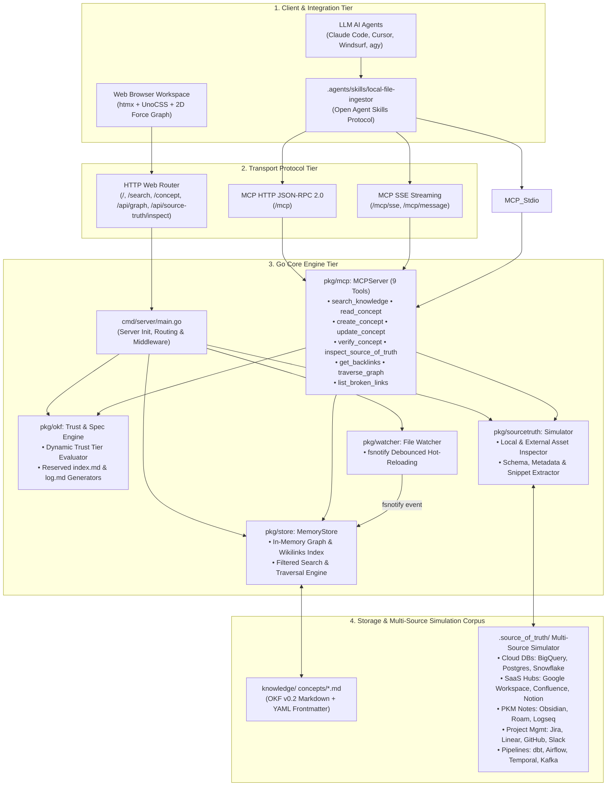
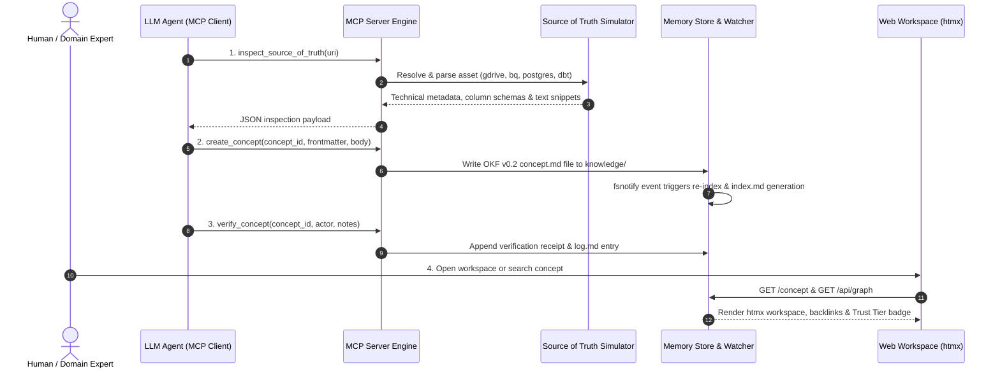
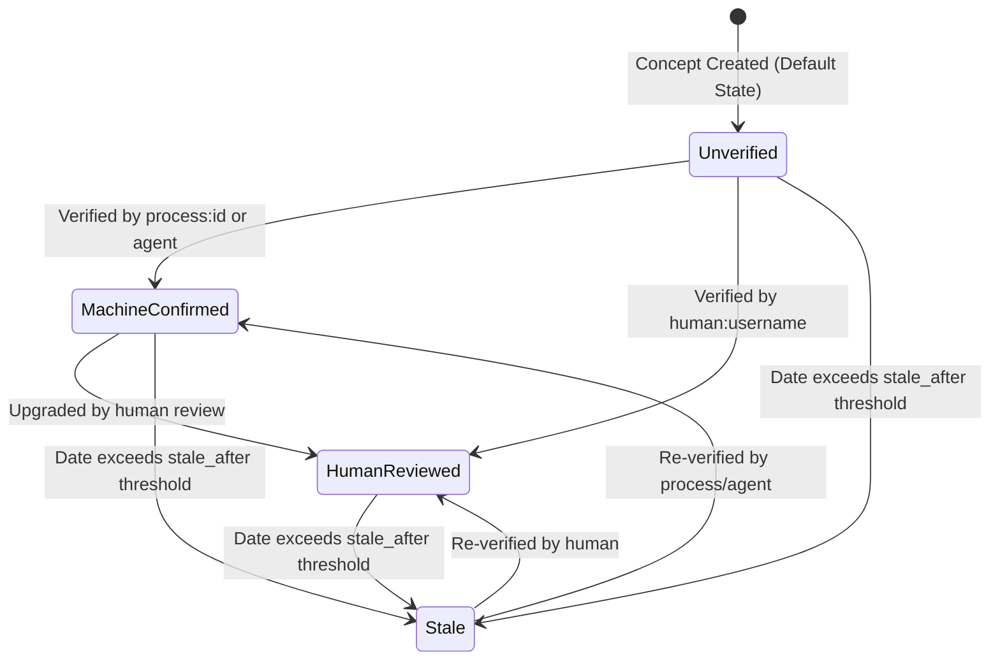

# Enterprise Open Knowledge Engine (OKF v0.2)

An open-spec, high-performance knowledge graph and human-AI collaboration platform implementing **Open Knowledge Format (OKF) v0.2**.

Built with a text-native, zero-database architecture in **Go**, **htmx**, **UnoCSS**, and **Goldmark**, the platform bridges human readability (Markdown + YAML frontmatter) with machine rigor (provenance, attestation, dynamic trust signals, and MCP tool protocols).

### 🌟 Executive Summary & Enterprise Pillars

1. **Human & Machine Collaboration**: Bridges human domain knowledge with AI agent execution through dynamic **Trust Tier** scoring (Human-Reviewed, Machine-Confirmed, Stale, Unverified), verification receipts, and computational attestations.
2. **Model Context Protocol (MCP) Engine**: Features a 9-tool JSON-RPC 2.0 MCP server over standard input/output (`-mcp-stdio`) and HTTP Server-Sent Events (`/mcp/sse`) enabling seamless integration with AI agents (Claude Code, Cursor, Windsurf, `agy`, or custom subagents).
3. **Source of Truth Simulation**: Includes a local file storage simulator (`.source_of_truth/`) allowing humans and agents to inspect external technical assets (Google Drive PDFs, Google Sheets, GCS objects, BigQuery schemas, PostgreSQL DDLs, OpenAPI specs, and dbt models) without cloud credentials during local dev and testing.
4. **Open Agent Ingestion Skills**: Implements standard Open Agent Skills ([`.agents/skills/local-file-ingestor/SKILL.md`](.agents/skills/local-file-ingestor/SKILL.md)) enabling autonomous LLM agents to inspect local documents, semantically extract domain entities, decompose monolithic files into atomic concepts, and dynamically discover novel concept types (`Kafka Topic`, `ML Feature Store`, `Data Contract`).
5. **Bidirectional Knowledge Graph**: Automatically parses `[[wikilinks]]`, renders interactive 2D force-directed graph visualizers, and provides real-time hot-reloading via `fsnotify`.

For planned features, upcoming enhancements, and the product roadmap, see [PLANNED.md](PLANNED.md).

---

## 🛠️ Technology Stack

| Layer / Category | Technology | Description |
| :--- | :--- | :--- |
| **Knowledge Spec** | **Open Knowledge Format (OKF v0.2)** | Open text-native specification defining Markdown + YAML frontmatter with 5 metadata families (Identity, Provenance, Trust, Lifecycle, Attestation) and reserved documents (`index.md`, `log.md`). |
| **Backend Core** | **Go (Golang 1.22+)** | Zero-framework core server, HTTP router (`net/http`), and template engine (`html/template`). |
| **Data Engine** | **Thread-Safe In-Memory Store** | Zero-database architecture with in-memory graph indexer, search engine, and `[[wikilinks]]` parser. |
| **Agent Protocol** | **MCP JSON-RPC 2.0 Engine** | Native 9-tool Model Context Protocol server supporting `stdio`, HTTP (`/mcp`), and SSE streaming (`/mcp/sse`). |
| **Agent Skills** | **Open Agent Skills Protocol** | Interoperable skill manifests (`.agents/skills/local-file-ingestor`) for Claude Code, Cursor, Windsurf, and `agy`. |
| **Frontend UI** | **htmx 1.9.10** | Dynamic HTML-over-the-wire UI updates for live search, sidebar filters, inspector drawers, and verification badges. |
| **Styling & Theme** | **UnoCSS & Tailwind Reset** | Instant runtime utility CSS engine providing dark-themed, responsive enterprise workspace styling. |
---

## Key Capabilities

### 1. OKF v0.2 Specification Compliance
- **Text-Native Storage**: Conforms to the official [Google Cloud Platform OKF v0.2 Specification](https://github.com/GoogleCloudPlatform/knowledge-catalog).
- **5 Metadata Families**:
  1. **Identity**: `type` (required), `title`, `description`, `resource`, `tags`.
  2. **Provenance**: `sources` list (`id`, `resource`, `title`, `author`, `usage_count`, `last_modified`) and `usage_window`.
  3. **Trust & Verification**: `generated` (`by`, `at`) and `verified` (`[{ actor, at, notes }]`).
  4. **Lifecycle**: `status` (`draft`, `stable`, `deprecated`) and `stale_after`.
  5. **Attestation**: `attestation` block (`runtime`, `executor`, `computation`, `parameters`) for deterministic computations.
- **Reserved Documents (§3.1)**: Automated generation of `index.md` (directory table for agent discovery) and `log.md` (chronological audit log).

### 2. Dynamic Trust Tier Engine
Computes credibility at read-time instead of storing static scores:
- 🟢 **Human-Reviewed**: Verified by a human actor (`human:username`).
- 🔵 **Machine-Confirmed**: Verified by automated agents/pipelines (`process:id` or `producer/version`).
- 🟡 **Stale**: Current timestamp exceeds `stale_after` expiration threshold.
- ⚪ **Unverified**: Default state for unreviewed concepts.

### 3. Bidirectional Knowledge Graph & Backlinks
- Scans `[[wikilinks]]` in concept bodies to build bidirectional graph edges in memory.
- Displays **Referenced By (Backlinks)** and **Links To** cards for instant graph traversal.

### 4. Model Context Protocol (MCP) Server for LLM Agents
- Native JSON-RPC 2.0 MCP handler in Go (`pkg/mcp/server.go`) supporting both standard `stdio` (`-mcp-stdio`) and HTTP Server-Sent Events (`/mcp/sse`).
- Full toolset (9 tools):
  1. `search_knowledge`: Keyword search with `tier` and `concept_type` filters.
  2. `read_concept`: Full concept view with optional multi-source simulation inspection (`include_source_truth`).
  3. `create_concept`: Concept creation with full OKF v0.2 frontmatter fields (`resource`, `sources`, `tags`, `stale_after`).
  4. `update_concept`: Dual-parameter body update (`body` replace / `append_body`) and YAML frontmatter field edits.
  5. `verify_concept`: Attestation submission promoting concept Trust Tier.
  6. `inspect_source_of_truth`: Simulation inspection for Google Drive PDFs, Google Sheets, GCS objects, and database schemas.
  7. `get_backlinks`: 1-hop reverse lookup for incoming links (impact analysis).
  8. `traverse_graph`: N-hop breadth-first search graph traversal (`max_depth: 1..4`).
  9. `list_broken_links`: Automated detection of dangling `[[wikilinks]]`.

### 5. Source of Truth & External File Storage Simulator
- **Canonical Resource & Upstream Lineage**: Renders canonical source of truth banners and upstream lineage cards for concepts linking to external assets.
- **Local File Store Simulator (`.source_of_truth/`)**: Simulates external document storage (Google Drive, Cloud Storage GCS, AWS S3, local file shares) holding PDFs, Google Docs, Spreadsheets, and CSVs without requiring cloud tokens during local dev/testing.
- **Interactive HTMX Document Inspector Drawer**: Side drawer allowing humans to inspect document summaries, page counts, owner badges, spreadsheet column schemas, and text snippets.

### 6. Local File Ingestion Agent Skill
- **Semantic Content Extraction**: AI agents read local files (`.pdf`, `.csv`, `.md`, `.sql`, `.yaml`) via `inspect_source_of_truth` and extract domain entities based on semantic meaning rather than raw filenames.
- **Multi-Concept Decomposition**: Monolithic local files are decomposed into $N$ atomic OKF concepts, preserving shared parent file lineage (`resource: file:///...`).
- **Dynamic Concept Type Discovery**: Automatically identifies and registers novel concept types (`Kafka Topic`, `ML Feature Store`, `Data Contract`), dynamically populating the Web UI sidebar filters.

### 7. Interactive 2D Knowledge Graph Visualizer
- Force-directed graph canvas modal (`force-graph` + UnoCSS).
- Color-coded nodes by **Trust Tier**.
- Smoothly centers, zooms, and highlights the currently active concept with a glowing cyan ring.

### 8. Real-Time Hot-Reload File Watcher (`fsnotify`)
- Recursively monitors the `knowledge/` directory for `.md` file edits from Git (`git pull`), Obsidian, text editors, or AI agents.
- Automatically re-indexes the memory store and updates `index.md` in real-time without server restarts.

### 9. Dynamic Sidebar Filters
- Real-time filtering by keyword query, **Trust Tier** (Human, Machine, Unverified), and **Concept Type** (`BigQuery Table`, `PostgreSQL Table`, `Metric`, `Policy`, `API Endpoint`, `Playbook`, `dbt Model`, `Data Pipeline`, `Kafka Topic`, `ML Feature Store`, `Data Contract`).

---


## 🏛️ System Architecture

> For the long-term target architecture vision (hybrid RAG search, automated attestation runners, and federated mesh), see **[END_GOALS_HIGH_LEVEL_ARCHITECTURE.md](docs/END_GOALS_HIGH_LEVEL_ARCHITECTURE.md)**.

### 1. High-Level Component & Transport Architecture

The platform utilizes a text-native, zero-database architecture in Go. The diagram below details the interactions between interactive client interfaces, transport protocols, the Go core engine, and storage corpora.



### 2. Autonomous Agent Ingestion & Attestation Flow

This sequence shows how an AI agent autonomously inspects multi-source external assets, ingests & decomposes concepts into OKF v0.2 format, attests credibility, and updates the human web workspace in real time.



### 3. Dynamic Trust Tier State Machine

The Trust Tier engine evaluates credibility dynamically at read-time based on frontmatter attestation records and `stale_after` expiration limits.




---

## Directory Architecture

```text
.
├── cmd/
│   └── server/
│       └── main.go              # Server routing, flag parsing, and HTTP handlers
├── docs/
│   ├── DESKRIPSI_DAN_TARGET_PENGGUNA.md    # Ringkasan Proyek, Solusi, & Target Pengguna (ID)
│   ├── END_GOALS_HIGH_LEVEL_ARCHITECTURE.md # Target Vision System Architecture Spec
│   ├── LOCAL_FILE_INGESTION_SKILLS_SPEC.md  # Spec for Local File Ingestion Agent Skills
│   ├── SOURCE_OF_TRUTH_LOCAL_SIMULATION_SPEC.md # Spec for Source of Truth Simulation
│   └── MCP_EXPANSION_SPEC.md      # Spec for Model Context Protocol Expansion
├── .agents/
│   └── skills/
│       └── local-file-ingestor/
│           └── SKILL.md         # Open Agent Skill for Local File Ingestion
├── examples/
│   └── skills/
│       └── local-file-ingestor/
│           └── SKILL.md         # Reference Skill Template
├── pkg/
│   ├── okf/
│   │   ├── spec.go              # OKF v0.2 structs & actor conventions
│   │   ├── trust.go             # Dynamic trust tier calculation algorithm
│   │   └── generator.go         # Reserved index.md and log.md auto-generators
│   ├── sourcetruth/
│   │   ├── models.go            # AssetType, Column, Inspection data models
│   │   ├── resolver.go          # URI parser for gdrive://, gs://, s3://, file://
│   │   ├── simulator.go         # Inspector engine reading local metadata & text snippets
│   │   └── resolver_test.go     # Go unit tests for external storage simulator
│   ├── store/
│   │   └── memory.go            # Thread-safe in-memory graph store & search
│   ├── mcp/
│   │   ├── server.go            # Panic-safe MCP JSON-RPC 2.0 server with 9 tools
│   │   ├── sse.go               # HTTP Server-Sent Events (SSE) streaming transport
│   │   └── server_test.go       # Go unit & integration test suite for MCP
│   └── watcher/
│       └── watcher.go           # Real-time fsnotify file watcher with debouncing
├── .source_of_truth/            # Local File Storage Simulator Corpus
│   ├── local_samples/           # Local multi-concept documents & meeting notes
│   ├── bigquery/                # BigQuery mock table schemas & sample CSVs
│   ├── postgres/                # PostgreSQL DDL table schemas
│   ├── apis/                    # OpenAPI 3.0 microservice REST specs
│   ├── dbt/                     # dbt SQL transformation models
│   ├── gdrive/                  # Google Drive PDF & Spreadsheet mock files
│   ├── gcs/                     # Google Cloud Storage mock objects
│   └── s3/                      # AWS S3 mock exports
├── templates/
│   ├── index.html               # Main htmx layout with UnoCSS & Force Graph modal
│   └── fragments/
│       ├── list.html            # Sidebar concept list with Trust Tier & Type filters
│       ├── concept.html         # Concept workspace with backlinks & Source of Truth banners
│       ├── source_inspector.html# Interactive HTMX Document & Schema Inspector Drawer
│       └── trust_badge.html     # Interactive human verification fragment
└── knowledge/                   # OKF v0.2 Markdown Corpus
    ├── index.md                 # Auto-generated bundle index
    ├── log.md                   # Auto-generated audit log
    └── concepts/
        ├── customer_orders.md
        ├── customer_profiles.md
        ├── freshness_playbook.md
        ├── revenue_metric.md
        ├── subscription_plans.md
        ├── fraud_detector.md
        ├── data_retention_policy.md
        ├── dbt_orders_mart.md
        ├── order_fulfillment_pipeline.md
        ├── real_time_checkout_events.md
        ├── customer_churn_feature_set.md
        ├── contract_checkout_events.md
        └── source_of_truth_local_simulation_spec.md
```

---

## Getting Started

### Prerequisites
- **Go**: 1.22+ installed.

### Installation

```bash
# Clone the repository
git clone https://github.com/khhini/enterprise-open-knowledge-graph.git
cd enterprise-open-knowledge-graph

# Download Go dependencies
go get github.com/yuin/goldmark
go get gopkg.in/yaml.v3
go get github.com/fsnotify/fsnotify
```

### Running the Web Server

```bash
go run cmd/server/main.go
```

Open your browser at `http://localhost:8080` to access the interactive platform.

### Connecting to LLM AI Agents (MCP Mode)

When the server is running (`go run cmd/server/main.go`), LLM agents (Claude Code, Cursor, Windsurf, `agy`, or custom subagents) connect to the MCP server via HTTP or SSE endpoints:

- **HTTP JSON-RPC Endpoint**: `http://localhost:8080/mcp`
- **HTTP Server-Sent Events (SSE) Endpoint**: `http://localhost:8080/mcp/sse`

#### MCP Plugin Config (`mcp_config.json`)

**HTTP Transport Example:**
```json
{
  "mcpServers": {
    "okf-knowledge-engine": {
      "url": "http://localhost:8080/mcp",
      "transport": "http"
    }
  }
}
```

**SSE Transport Example:**
```json
{
  "mcpServers": {
    "okf-knowledge-engine-sse": {
      "url": "http://localhost:8080/mcp/sse",
      "transport": "sse"
    }
  }
}
```

---

## License

Open source under the [Apache 2.0 License](LICENSE).
