# 🎯 End-Goal Target High-Level Architecture

**Version:** 2.0 (Target Vision)  
**Status:** Architecture Specification & Roadmap Target  
**Scope:** Enterprise Open Knowledge Engine (OKF v0.2), Hybrid RAG Search, Automated Attestation Runners, Knowledge Health Analytics, and Federated Mesh.

---

## 1. Executive Vision

The ultimate goal of the **Enterprise Open Knowledge Engine** is an **autonomous, verifiable, and federated enterprise knowledge mesh**. It bridges human domain expertise, AI agent skills, automated validation runners, and hybrid RAG search engines into a unified text-native corpus conforming to **Open Knowledge Format (OKF) v0.2**.

```mermaid
flowchart TD
    subgraph Interfaces["1. Human & Agent Interactive Interfaces"]
        UI["Web Workspace & In-Browser WYSIWYG Editor<br/>(htmx + Monaco Editor + 2D/3D Force Graph)"]
        Analytics["Knowledge Health & Analytics Dashboard<br/>(Trust Distribution, Freshness Monitor, Graph Topology)"]
        Agents["AI Agents & Multi-Agent Swarms<br/>(Claude Code, Cursor, Windsurf, agy)"]
        CLI["OKF Linter CLI (`okf lint`)"]
    end

    subgraph Protocols["2. Unified Protocol & Transport Layer"]
        HTTP_Endpoints["REST & HTMX Endpoints"]
        MCP_Engine["MCP JSON-RPC 2.0 Engine (stdio, HTTP, SSE, WebSocket)"]
        Skill_Protocol["Open Agent Skills Registry (.agents/skills/)"]
    end

    subgraph CoreEngine["3. Intelligent Core Processing Engine"]
        MemStore["Thread-Safe In-Memory Store & Graph Indexer"]
        
        subgraph SearchEngine["Hybrid Search Engine"]
            BM25["BM25 Full-Text Search (Bleve Engine)"]
            VectorRAG["Semantic Vector Search (Chromem-Go / Ollama Embeddings)"]
        end
        
        subgraph Automation["Automated Verification Runner"]
            AttestationRunner["Attestation Execution Engine<br/>(SQL / API / Data Freshness Checkers)"]
            TrustTierEngine["Dynamic Trust Tier Evaluator<br/>(Human-Reviewed / Machine-Confirmed / Stale)"]
        end
        
        Watcher["fsnotify Hot-Reload File Watcher"]
    end

    subgraph Simulation["4. Source of Truth & External Multi-Source Integration Layer"]
        Simulator["Local Storage Simulator (.source_of_truth/)"]
        CloudConnectors["Data Warehouses & Cloud Storage<br/>(BigQuery, Postgres, Snowflake, GCS, S3)"]
        SaaSWorkspaces["SaaS Workspaces & Knowledge Hubs<br/>(Google Docs/Sheets, Confluence, Notion, Coda)"]
        NoteApps["Note-Taking & PKM Systems<br/>(Obsidian, Roam, Logseq, Bear)"]
        ProjectManagement["Project Management & Collaboration<br/>(Jira, Linear, GitHub Issues/PRs, Slack)"]
        Orchestration["Data Pipelines & Orchestration<br/>(dbt, Airflow, Temporal, Kafka)"]
    end

    subgraph Storage["5. Text-Native Corpus & Federated Mesh"]
        Corpus["knowledge/concepts/*.md<br/>(OKF v0.2 Markdown + YAML Frontmatter)"]
        FederatedMesh["Federated OKF Mesh<br/>(P2P Engine-to-Engine Synchronization)"]
    end

    Interfaces --> Protocols
    Protocols --> CoreEngine
    CoreEngine --> Simulation
    CoreEngine <--> Storage
    Simulation <--> Storage
```

---

## 2. Source of Truth Multi-Source Integration Framework

The Open Knowledge Engine connects to 5 distinct families of external sources of truth:

| Source Category | Supported Platforms & Protocols | Typical Ingested Concept Types |
| :--- | :--- | :--- |
| **1. Cloud Data Warehouses & Databases** | BigQuery, PostgreSQL, Snowflake, Redshift, MySQL | `BigQuery Table`, `PostgreSQL Table`, `Database View` |
| **2. SaaS Workspaces & Enterprise Hubs** | Google Docs/Sheets/Drive, Confluence, Notion, Coda, SharePoint | `Specification`, `Policy`, `PRD`, `Data Dictionary` |
| **3. Personal Note-Taking & PKM Apps** | Obsidian, Roam Research, Logseq, Bear, Apple Notes | `Concept`, `Knowledge Note`, `Meeting Notes` |
| **4. Project Management & Team Chat** | Jira, Linear, Asana, GitHub Issues/PRs, Slack, Teams | `Issue / Ticket`, `Pull Request`, `Incident Playbook` |
| **5. Data Pipelines & Orchestration** | dbt, Apache Airflow, Temporal, Dagster, Apache Kafka | `dbt Model`, `Data Pipeline`, `Kafka Stream Topic` |

---

## 3. Target Architectural Pillars

### Pillar 1: Hybrid Search & RAG Engine (BM25 + Local Vector Embeddings)
- **BM25 Keyword Search (`bleve`)**: Full-text indexing with field-weighted scoring (`title` > `tags` > `body`), text stemming, and fuzzy matching.
- **Semantic Vector RAG (`chromem-go` / Ollama)**: Natural language semantic search (e.g. searching *"How do we handle user deletion requests?"* matches `data_retention_policy.md` without needing exact keyword overlap).

### Pillar 2: Automated Attestation Execution Runner
- Background runner reading the `attestation` metadata block (`runtime`, `executor`, `computation`, `parameters`) to run live verification queries (SQL assertions, API health checks, freshness tests).
- Automatically promotes verified concepts to **`Machine-Confirmed`** trust tier.

### Pillar 3: In-Browser WYSIWYG & Frontmatter Workspace
- Monaco Editor / EasyMDE integration with live side-by-side preview and `[[wikilink]]` auto-completion.
- Dynamic session authentication for accurate human verifier attribution (`human:username`).

### Pillar 4: Knowledge Health & Quality Analytics Dashboard
- **Trust Distribution Metrics**: Visual breakdown of % Human-Reviewed, % Machine-Confirmed, % Stale, and % Unverified concepts.
- **Freshness Monitor**: Real-time alerts for concepts approaching or past their `stale_after` threshold.
- **Graph Topology Metrics**: Identification of orphan concepts and primary hub entities.

### Pillar 5: `okf lint` Spec Enforcement CLI
- Standalone CLI utility and server endpoint to validate `knowledge/` Markdown files against the OKF v0.2 spec, catch broken `[[wikilinks]]`, enforce date formats, and warn about stale concepts.

### Pillar 6: Federated OKF Knowledge Mesh
- Engine-to-engine federation allowing multiple enterprise OKF instances to securely sync and query knowledge across organizational boundaries.
