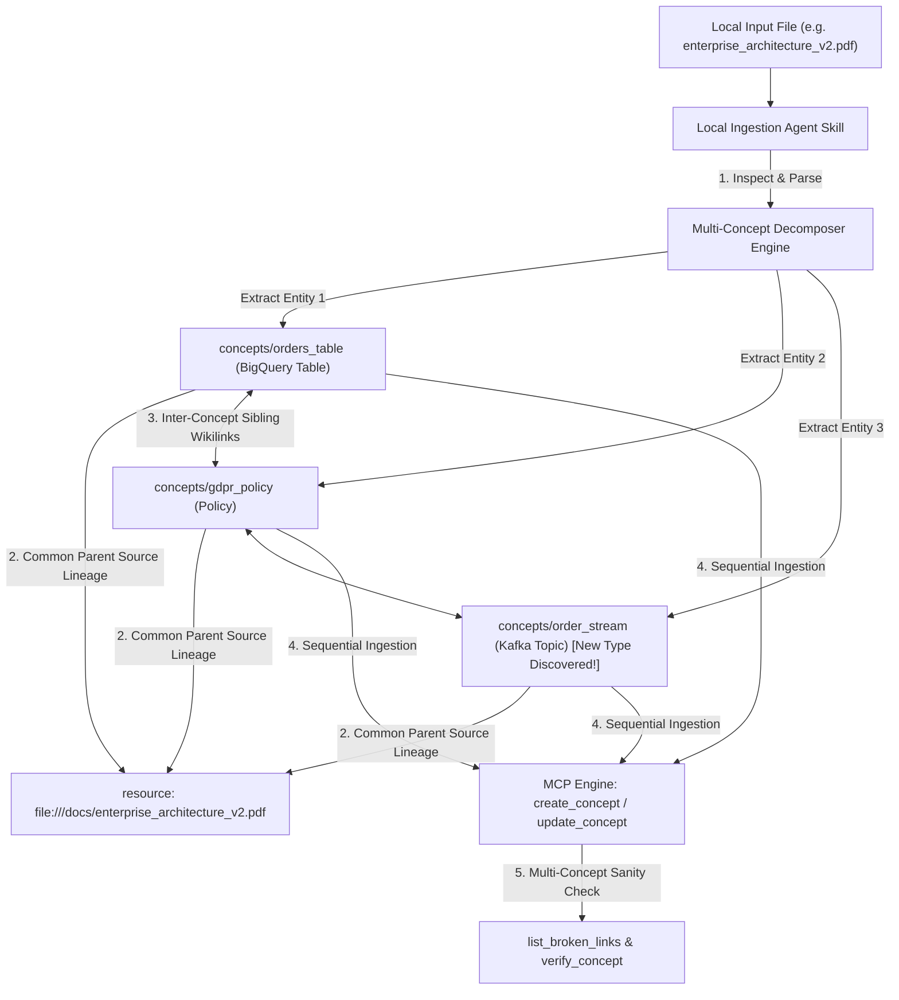
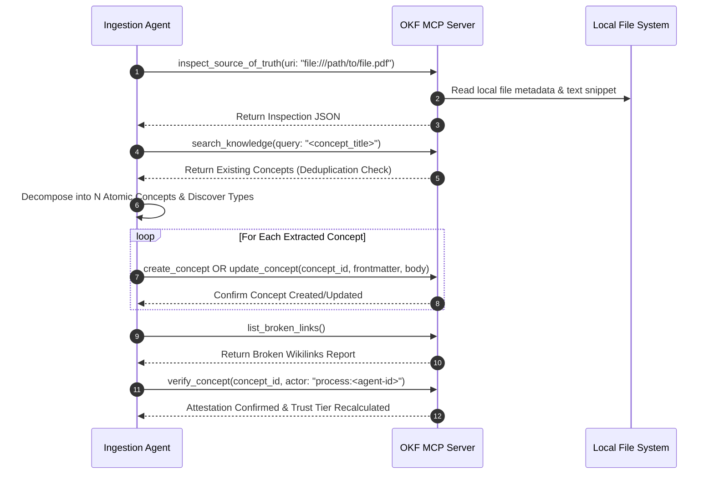

# 📐 Specification: Local File Ingestion Agent Skills for OKF Knowledge Engine

**Version:** 1.0  
**Status:** Active Specification  
**Scope:** Local File System Ingestion (`file://`), Multi-Concept Decomposition, Dynamic Concept Type Discovery, and OKF v0.2 Graph Integration.

---

## 1. Executive Summary & Purpose

The **OKF Knowledge Engine** serves as an enterprise knowledge graph connecting documentation, database schemas, metrics, policies, and data pipelines into a unified, human-and-machine-readable corpus.

This specification defines the standard architecture, protocols, and design patterns for building **AI Agent Ingestion Skills**. These skills enable autonomous LLM agents (such as `agy`, Cursor, Claude Code, or custom subagents) to inspect local files (`.pdf`, `.csv`, `.md`, `.sql`, `.yaml`), parse single or multi-concept documents, discover novel concept types, and programmatically ingest them into the OKF corpus via the **Model Context Protocol (MCP)**.

---

## 2. Supported Local File Formats & Initial Concept Mapping

| Local File Extension | Primary Content Characteristics | Default Primary Concept Type(s) | Typical Extracted Sub-Concepts |
| :--- | :--- | :--- | :--- |
| **`.pdf`** | Unstructured/Semi-structured specs, compliance docs, SLAs | `Policy`, `Specification`, `Playbook` | `Policy`, `Data Contract`, `Incident Playbook` |
| **`.csv` / `.tsv` / `.xlsx`** | Tabular exports, data dictionaries, billing logs | `Data Asset`, `Table Schema` | `Data Dictionary`, `Metric`, `Pricing Table` |
| **`.md` / `.txt`** | Architecture notes, PRDs, Obsidian vaults, meeting notes | `Concept`, `Knowledge Note` | `System Architecture`, `Business Domain`, `API Endpoint` |
| **`.sql`** | Database DDLs, queries, dbt transformation models | `PostgreSQL Table`, `dbt Model` | `BigQuery Table`, `Database View`, `Data Pipeline` |
| **`.json` / `.yaml`** | OpenAPI REST specs, Airflow DAGs, Terraform configs | `API Endpoint`, `Data Pipeline` | `Microservice`, `Kafka Topic`, `Cloud Resource` |

---

## 3. Multi-Concept & Multi-Type Decomposition Engine

A single real-world file (e.g., a 30-page architecture PDF or a multi-table SQL migration file) frequently contains **multiple distinct domain concepts and concept types**. Ingestion agents MUST NOT force a monolithic file into a single concept file. Instead, agents follow the **Atomic Decomposition Protocol**:



### Key Decomposition Rules:
1. **Atomic Responsibility**: Each extracted concept must represent a single, cohesive domain entity (e.g., one table, one metric, one policy).
2. **Shared Parent Lineage**: Every extracted concept links back to the exact parent local file URI (with optional section anchor or page number offsets):
   ```yaml
   resource: file:///Users/kikihutapea/docs/enterprise_architecture_v2.pdf#page=12
   sources:
     - id: parent-spec-file
       resource: file:///Users/kikihutapea/docs/enterprise_architecture_v2.pdf
       title: Enterprise Architecture & Governance Specification (v2.0)
       author: human:architecture-board
   ```
3. **Sibling Wikilink Weaving**: During extraction, the agent automatically weaves bidirectional `[[wikilinks]]` between sibling concepts extracted from the same parent document.

---

## 4. Dynamic Concept Type Discovery & Taxonomy Extension

While OKF defines standard initial concept types (`BigQuery Table`, `PostgreSQL Table`, `Metric`, `Policy`, `API Endpoint`, `Playbook`, `dbt Model`, `Data Pipeline`), local documents may introduce novel domain abstractions.

### Type Discovery Protocol:
When an ingestion agent encounters an entity that does not fit pre-existing types:

1. **Evaluate Domain Abstraction**: Assess whether the entity represents a re-usable domain pattern (e.g., `Kafka Topic`, `ML Feature Store`, `Data Contract`, `Grafana Alert Rule`, `IAM Policy`).
2. **Enforce Type Naming Conventions**:
   - Use **PascalCase / Title Case** with concise, descriptive names (2–3 words max).
   - Examples: `Kafka Stream Topic`, `ML Feature Store`, `Data Contract`, `Vector Index`.
   - Avoid vague type names like `General Info` or `Miscellaneous`.
3. **Automatic UI & Filter Integration**:
   - Ingesting a concept with a newly discovered `type` automatically propagates into the OKF Memory Store and populates the dynamic **Concept Type Sidebar Filter** in the Web UI without requiring code changes or server restarts.

---

## 5. End-to-End Local Ingestion Lifecycle (5-Step Protocol)

Every local file ingestion skill MUST execute the following 5-step sequence:



### Step Details:

#### Step 1: Local File Inspection (`inspect_source_of_truth`)
- The agent passes `file:///absolute/path/to/file` to `inspect_source_of_truth`.
- The MCP server inspects file byte size, mime-type, page counts (for PDFs), CSV column headers (for tabular files), or text snippets.

#### Step 2: Knowledge Graph Context & Deduplication (`search_knowledge`)
- Before creating a concept, the agent searches existing concepts to avoid creating duplicates.
- If an existing concept matches:
  - Call `update_concept` with `append_body` or `body` replacement instead of creating a duplicate file.
- If no existing concept matches:
  - Proceed with `create_concept`.

#### Step 3: Concept Extraction & Type Discovery
- Decompose file content into $N$ atomic concepts.
- Classify concept `type` using standard types or discover new types if necessary.
- Formulate YAML frontmatter according to **OKF v0.2 Specification**:
  ```yaml
  ---
  type: ML Feature Store
  title: Customer Churn Feature Set
  description: Real-time feature store vectors for customer churn ML inference models.
  resource: file:///Users/kikihutapea/docs/ml_pipeline_spec.yaml#section=features
  tags: [ml, feature-store, churn, inference]
  generated:
    by: process:local-file-ingestor/v1
    at: 2026-08-11T13:30:00Z
  sources:
    - id: parent-yaml-spec
      resource: file:///Users/kikihutapea/docs/ml_pipeline_spec.yaml
      title: Enterprise ML Pipeline & Feature Store Specification
      author: human:data-science-team
  status: draft
  stale_after: "2027-01-01"
  ---
  ```

#### Step 4: Knowledge Creation / Update (`create_concept` / `update_concept`)
- For new concepts: Invoke `create_concept` with complete frontmatter schema and body content.
- For existing concepts: Invoke `update_concept` using the **Dual-Parameter Strategy**:
  - `body`: Use when rewriting or refactoring existing body text.
  - `append_body`: Use when appending new audit notes, sections, or tables safely without modifying human text.

#### Step 5: Machine Attestation & Link Integrity Audit (`verify_concept` & `list_broken_links`)
- Invoke `list_broken_links` to verify that all inserted `[[wikilinks]]` point to valid concepts.
- Submit a machine attestation receipt via `verify_concept`:
  ```json
  {
    "concept_id": "concepts/customer_churn_feature_set",
    "actor": "process:local-file-ingestor/v1",
    "notes": "Ingested and validated from local file file:///Users/kikihutapea/docs/ml_pipeline_spec.yaml"
  }
  ```

---

## 6. Reference Agent Skill Architecture (`SKILL.md`)

Below is the standard `SKILL.md` instruction template for configuring local ingestion subagents:

```markdown
---
name: local-file-ingestor
description: Ingests local files (.pdf, .csv, .md, .sql, .yaml) into OKF concepts, decomposing multi-concept files, discovering new types, and generating bidirectional wikilinks.
---

# Local File Ingestion Instructions

When the user asks to ingest or import a local file or directory into the OKF Knowledge Engine:

1. **Inspect Local Source**:
   Call `inspect_source_of_truth` with `uri: "file://<absolute-path>"`.

2. **Deduplicate**:
   For each concept title identified in the file, call `search_knowledge` to check if a concept already exists.

3. **Decompose & Discover Types**:
   - If the file contains multiple entities, decompose into separate concepts.
   - Assign standard concept types or define concise PascalCase novel types (e.g. `ML Feature Store`).

4. **Write to OKF**:
   - For new concepts: Call `create_concept`.
   - For existing concepts: Call `update_concept` (using `append_body` or `body`).

5. **Verify & Audit**:
   - Call `list_broken_links` to verify `[[wikilinks]]`.
   - Call `verify_concept` with `actor: "process:local-file-ingestor/v1"`.
```

---

## 7. Error Handling, Conflict Resolution & Quality Gates

| Potential Issue / Failure Mode | Root Cause | Automated Agent Mitigation Strategy |
| :--- | :--- | :--- |
| **File Not Found / Unreadable** | Invalid `file://` URI or permission denied | Return clear error message detailing local path check; do not create empty concepts. |
| **Duplicate Concept Conflict** | Concept already exists in `knowledge/concepts/` | Call `update_concept(append_body: "...")` to merge new information instead of overwriting existing files. |
| **Dangling Wikilink Created** | Agent referenced `[[concepts/non_existent]]` | `list_broken_links` detects dangling link. Agent automatically generates a stub concept or corrects the link. |
| **Overly Broad Concept Type** | Agent picked vague type (e.g., `Misc`) | Re-evaluate entity against domain taxonomy guidelines and refine to specific Title Case type. |
