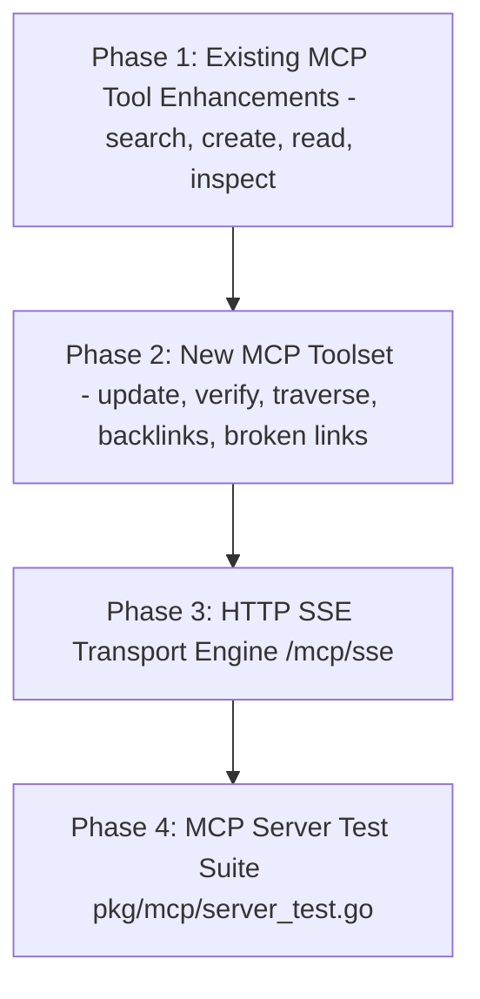

# Implementation Plan: MCP Protocol Expansion & SSE Transport

**Document Version:** 2.0.0 (Updated - Existing Tool Enhancements + Extended Toolset)  
**Target Completion:** Open Knowledge Engine v0.2  

---

## 📍 Plan Overview

This plan outlines the step-by-step implementation for expanding the **Model Context Protocol (MCP)** server in the Open Knowledge Engine.

It includes:
1. **Enhancements to Existing Tools**: Upgrading `search_knowledge` (tier/type filters), `create_concept` (complete frontmatter fields), `read_concept` (`include_source_truth` flag), and `inspect_source_of_truth` (`concept_id` lookup).
2. **5 New MCP Tools**: `update_concept`, `verify_concept`, `traverse_graph`, `get_backlinks`, `list_broken_links`.
3. **HTTP Server-Sent Events (SSE) Transport**: Remote HTTP transport (`/mcp/sse`).

---

## 🗺️ Execution Phases

---

## Phase 1: Existing MCP Tool Enhancements (`pkg/mcp/server.go`)

**Objective**: Upgrade existing tools to support filters, complete frontmatter fields, and automatic source inspection.

### Tasks:
- [ ] **Task 1.1**: Upgrade `search_knowledge`:
  - Add optional `tier` (`all`, `human`, `machine`, `unverified`) and `concept_type` parameters.
  - Wire to `store.SearchFiltered(query, tier, conceptType)`.
- [ ] **Task 1.2**: Upgrade `create_concept`:
  - Add optional `resource`, `sources`, `tags`, `stale_after`, `status` schema properties and parser.
- [ ] **Task 1.3**: Upgrade `read_concept`:
  - Add optional `include_source_truth` boolean flag.
  - When true, run `simulator.Inspect(concept.Frontmatter.Resource)` and attach to response.
- [ ] **Task 1.4**: Upgrade `inspect_source_of_truth`:
  - Add optional `concept_id` string property.
  - If `uri` is empty, look up `concept.Frontmatter.Resource`.

---

## Phase 2: Extended MCP Toolset Implementation (`pkg/mcp/server.go`)

**Objective**: Implement 5 new tool handlers in `pkg/mcp/server.go`.

### Tasks:
- [ ] **Task 2.1**: Implement `update_concept` tool handler:
  - Parse `concept_id`, `agent_id`, `append_body`, and `frontmatter_updates` (`type`, `title`, `description`, `status`, `tags`, `stale_after`, `resource`, `sources`, `usage_window`, `attestation`).
  - Update YAML frontmatter fields in memory and write through to `.md` file.
  - Append audit entry in `log.md`.
- [ ] **Task 2.2**: Implement `verify_concept` tool handler:
  - Append verification record, recalculate Trust Tier, write to filesystem, log to `log.md`.
- [ ] **Task 2.3**: Implement `get_backlinks` & `traverse_graph` tool handlers:
  - Traverse `store.MemoryStore` link graph up to `max_depth`.
- [ ] **Task 2.4**: Implement `list_broken_links` tool handler:
  - Scan memory store for wikilinks pointing to non-existent concepts.

---

## Phase 3: HTTP Server-Sent Events (SSE) Transport (`/mcp/sse`)

**Objective**: Add real-time HTTP SSE streaming support for remote AI agents.

### Tasks:
- [ ] **Task 3.1**: Implement SSE Session Manager in `pkg/mcp/sse.go`.
- [ ] **Task 3.2**: Implement `GET /mcp/sse` and `POST /mcp/message` handlers.
- [ ] **Task 3.3**: Register HTTP routes in `cmd/server/main.go`.

---

## Phase 4: Unit & Integration Test Suite (`pkg/mcp/server_test.go`)

**Objective**: Achieve comprehensive unit and integration test coverage for all MCP handlers and transports.

### Tasks:
- [ ] **Task 4.1**: Test tool schema outputs (`tools/list`).
- [ ] **Task 4.2**: Test tool enhancements (`search_knowledge` filters, `create_concept` frontmatter, `read_concept` source truth).
- [ ] **Task 4.3**: Test `update_concept`, `verify_concept`, `traverse_graph`, `get_backlinks`, and `list_broken_links`.
- [ ] **Task 4.4**: Test SSE HTTP streaming transport (`/mcp/sse` & `/mcp/message`).

---

## ⏱️ Timeline & Resource Matrix

| Phase | Description | Estimated Time | Key Deliverable Files |
| :--- | :--- | :--- | :--- |
| **Phase 1** | Existing Tool Enhancements | 1 Hour | `pkg/mcp/server.go` |
| **Phase 2** | 5 New MCP Tool Handlers | 2 Hours | `pkg/mcp/server.go` |
| **Phase 3** | HTTP SSE Transport | 2 Hours | `pkg/mcp/sse.go`, `cmd/server/main.go` |
| **Phase 4** | Test Suite & Verification | 1.5 Hours | `pkg/mcp/server_test.go` |

---

## ❓ Decision Points & Feedback Request

> [!IMPORTANT]
> Please review this updated specification and implementation plan for MCP Protocol Expansion. Click **Proceed** on the plan artifact to begin step-by-step implementation review, or let me know if you would like any adjustments!
