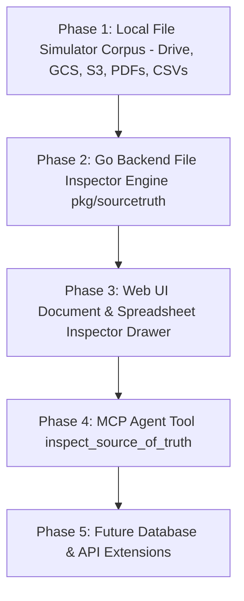

# Implementation Plan: OKF Source of Truth & External File Storage Simulator

**Document Version:** 2.0.0 (Revised - File Storage First)  
**Target Completion:** Open Knowledge Engine v0.2  

---

## 📍 Plan Overview

This plan outlines the revised, step-by-step implementation for bringing **Source of Truth & Upstream Lineage capabilities** into the Open Knowledge Engine.

The initial implementation focuses on **External File Storage Simulation** (Google Drive documents, PDFs, Google Sheets spreadsheets, GCS/S3 cloud objects, and local files).

---

## 🗺️ Execution Roadmap

---

## Phase 1: Local File Simulator Corpus & Mock Storage Files

**Objective**: Establish the local mock file structure representing external document storage (Google Drive, GCS, S3) containing PDFs, Docs, Spreadsheets, and text files.

### Tasks:
- [x] **Task 1.1**: Build `.source_of_truth/` directory hierarchy:
  - `.source_of_truth/gdrive/finance/`
  - `.source_of_truth/gdrive/analytics/`
  - `.source_of_truth/gcs/data-lake-prod/documents/`
  - `.source_of_truth/s3/enterprise-data/exports/`
- [x] **Task 1.2**: Populate Google Drive PDF & Doc mock files:
  - `.source_of_truth/gdrive/finance/mrr_spec.pdf.meta.json` (metadata: owner, size, 14 pages, summary).
  - `.source_of_truth/gdrive/finance/mrr_spec.pdf.txt` (extracted text preview).
- [x] **Task 1.3**: Populate Google Spreadsheet CSV mock files:
  - `.source_of_truth/gdrive/analytics/q3_subscription_billing_report.csv.meta.json` (metadata: owner, 520 rows).
  - `.source_of_truth/gdrive/analytics/q3_subscription_billing_report.csv` (CSV tabular rows).
- [x] **Task 1.4**: Populate GCS & S3 document mock files:
  - `.source_of_truth/gcs/data-lake-prod/documents/privacy_policy_v2.pdf.meta.json`
  - `.source_of_truth/gcs/data-lake-prod/documents/privacy_policy_v2.txt`
- [x] **Task 1.5**: Update concept files in `knowledge/concepts/*.md` to link to these external file storage resources.

---

## Phase 2: Go Backend File Inspector Engine (`pkg/sourcetruth`)

**Objective**: Build Go package to resolve external document URIs, inspect metadata JSONs, extract document text snippets, and parse CSV spreadsheet rows.

### Tasks:
- [x] **Task 2.1**: Define models in `pkg/sourcetruth/models.go` (`Inspection`, `AssetType`, `Column`).
- [x] **Task 2.2**: Implement URI parser in `pkg/sourcetruth/resolver.go`:
  - Support `gdrive://`, `gs://`, `s3://`, `file://`, and Google Drive/Docs web links.
- [x] **Task 2.3**: Implement `Simulator.Inspect(uri string)` in `pkg/sourcetruth/simulator.go`:
  - Load `.meta.json` files and read text snippets or CSV spreadsheet columns.
- [x] **Task 2.4**: Add unit tests in `pkg/sourcetruth/resolver_test.go` verifying document inspection and error handling.

---

## Phase 3: Web UI Document & Spreadsheet Inspector Drawer

**Objective**: Upgrade the concept view page to render external document banners, lineage cards, and an interactive HTMX document preview drawer.

### Tasks:
- [x] **Task 3.1**: Create HTMX template fragment `templates/fragments/source_inspector.html`:
  - Render Document Summary, Page Count, Owner Badge, and Text Preview for PDFs/Docs.
  - Render Formatted Table for CSV spreadsheets.
- [x] **Task 3.2**: Update concept fragment `templates/fragments/concept.html`:
  - Embed **"📄 Inspect Document"** trigger button.
  - Render Upstream Lineage Cards with status indicators (Exists / Missing).
- [x] **Task 3.3**: Register HTTP route `GET /api/source-truth/inspect?uri={uri}` in web server.

---

## Phase 4: MCP Agent Integration & E2E Testing

**Objective**: Expose document inspection to LLM agents via MCP and verify the full workflow.

### Tasks:
- [x] **Task 4.1**: Register `inspect_source_of_truth` tool in `pkg/mcp/server.go`.
- [x] **Task 4.2**: Test LLM agent tool call retrieving document text snippets and spreadsheet columns.
- [x] **Task 4.3**: End-to-End manual testing in Web UI.

---

## Phase 5: Future Database & API Schema Expansion

**Objective**: (Subsequent milestone) Extend the simulator to handle database table schemas (BigQuery, PostgreSQL) and OpenAPI endpoints.

---

## ❓ Decision Points & Feedback Request

> [!IMPORTANT]
> Please review this revised implementation plan focusing on external document & spreadsheet file storage representations. Click **Proceed** when you'd like me to begin execution!
