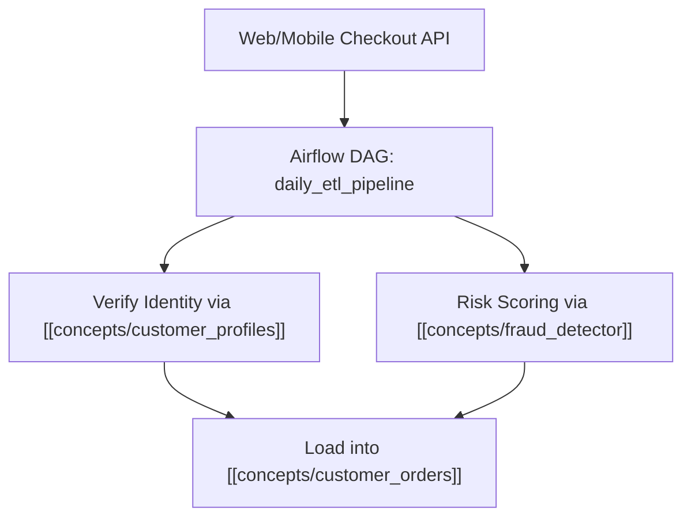

# Pipeline Architecture

The order fulfillment pipeline runs daily at 02:00 UTC to ingest completed sales transactions into [[concepts/customer_orders]] and synchronize account tiers in [[concepts/customer_profiles]].

# Failure & SLA Procedures

In the event of DAG failure or pipeline lag exceeding 60 minutes, immediately initiate the incident response steps in [[concepts/freshness_playbook]].
